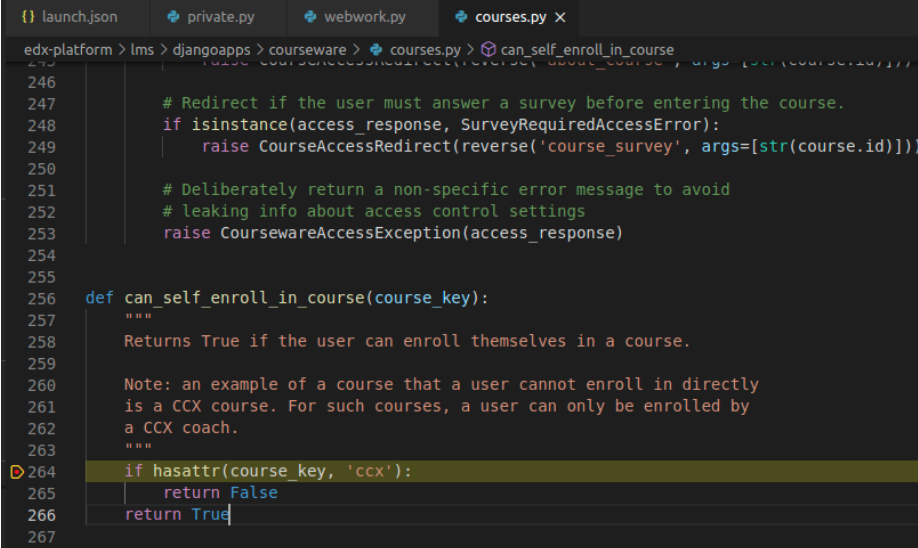
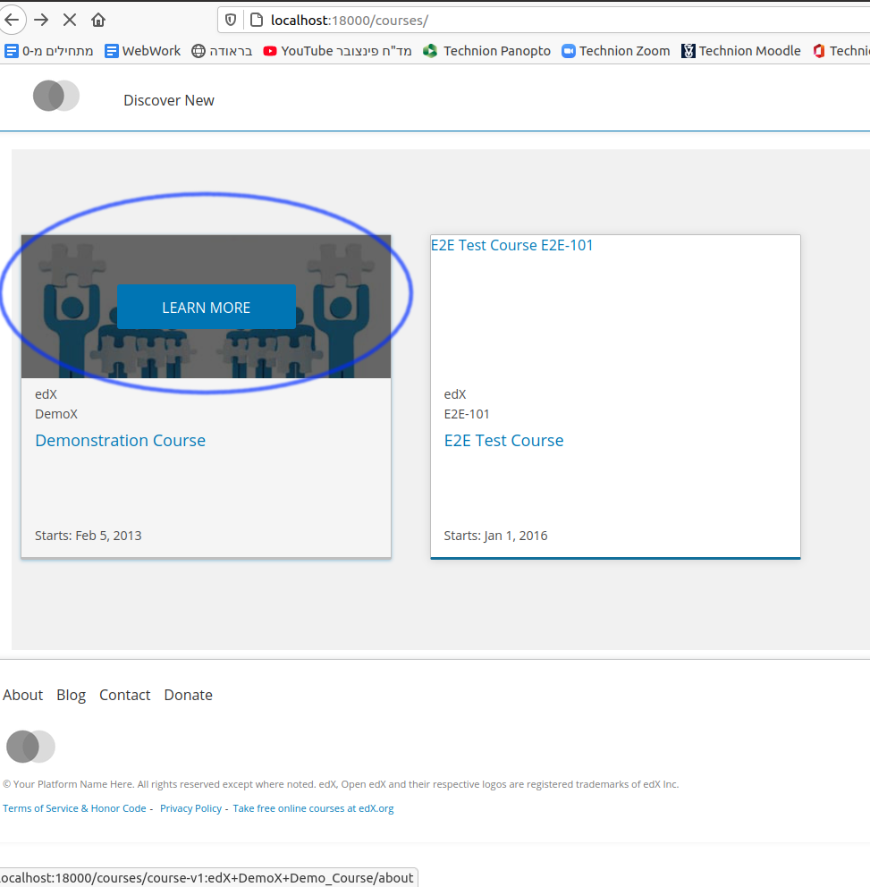
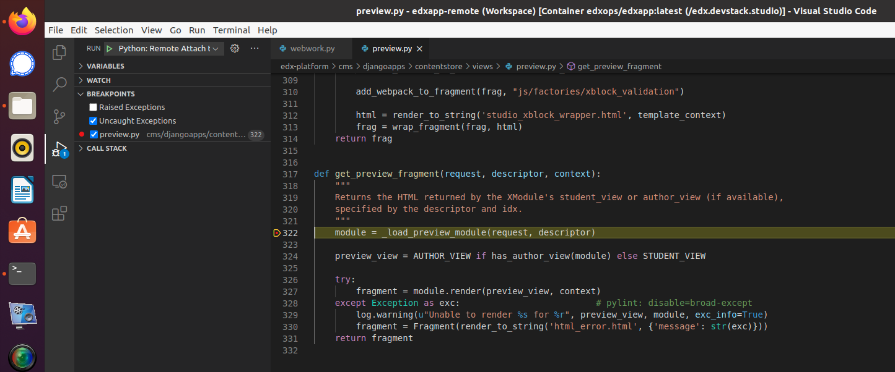

<!--
Colors convention: a Bootstrap-like color convention is followed see e.g.
https://www.w3schools.com/bootstrap4/bootstrap_colors.asp

Uncomment these HTML lines to see the effect and
copy-paste in document up to need

Primary text  
Success text  
Info text here  
Warning text  
Danger text  
Faded text  
-->

# 1. Preliminaries
This Tutorial should help the reader to install xblock-webwork into Open edX's full devstack environment and debug it with VS-Code.

edx-devstack environment pros-and-cons when compared with Open xblock-sdk environment:

**Pros:**
- Follow the full/accurate view of Open edX's course site
- Inherently supports course deadlines, grades, and  
  other management operations
- Therefore it is equiped with full development capabilities
- Accurately flags security and network complexities

**Cons:**
+ Heavy disc/cash/cpu usage
+ Though to install 
+ Though to debug
+ Thus remarkably slows down developing

It assumes that the reader have basic experience working with  
- linux shell commands
- python
- VS-Code
- Open edX's xblocks
- Open edX's devstack services (lms/studio etc')
- Docker containers.

Following this tutorial up to a successful end, will arm you with the capabilities of running webwork-xblock in edx-devstack environment and debug it through VS-Code (set breakpoints, watch variable values etc') 

Happy ending requires careful follow of the listed steps.

**Good luck!**

# 2. Prerequisites
1. Ubuntu + Python + virtualenv
2. VS-Code with python + django + docker extension packs
3. Access to technion webwork2 server (contact Nathan Wallach (tani@mathnet.technion.ac.il) to acquire Authenticated user+password

# 3. installing Open edX Devstack
These instructions are based on the Edx instructions here:   
[Open edX Devstack](https://github.com/edx/devstack#open-edx-devstack--)

**XblockEx** directory name was selected for practical explanation reasons.  
Change it to your needs when following the instructions  

1. Create the directory:
    > mkdir XblockEx  
      cd XblockEx  
      mkdir edx-devstack  
      cd edx-devstack

2. Create and activate python virtual environment:
   >virtualenv venv  
    source venv/bin/activate

3. Clone and install Open-edX devstack:
   >git clone https://github.com/edx/devstack.git  
   cd devstack  
   make requirements  
   make dev.clone.https  
   make dev.pull  
   make dev.provision  
   make dev.down  
   + Note: provision takes several minutes to accomplish  

4. Activate all Open-edX service (containers) fleet and **wait at least 1-minute** after the command claims it is "done"
   > make dev.up
5. Verify all (17) containers are up (as opposed to Exited or othe state) with
   > docker ps -a
   + Note: consider using the watch command in a new command shell in order to watch the containers state indefinitly:  
     >watch -n1 "docker ps -a"  
6. Wait about 1-minute and check it out to work properly in your browser:  
    http://localhost:18000  
      

    > make dev.down

7. Clone ofek’s xblock webwork into  
   ~/XblockEx/edx-devstack/edx-platform/src/ :  
    >cd ../edx-platform/  
    mkdir src  
    cd src  
    git clone https://github.com/tsabaryg/xblock-webwork.git  
    * You will need to supply a git user and password with access permission.  
    Contact guyts@technion.ac.il or tani@mathnet.technion.ac.il for permission request.

8.  Improve docker-compose.yml to include xblock-webwork:  
    > cd /home/guy/XblockEx/edx-devstack/devstack  
    + Open docker-compose.yml with VS-Code or nano
    + Navigate in the file Under the line of  
      lms: 
      > replace (comment the previous for backup) the long bash command into:  
        > 
          lms:  
            command: >
              bash -c '
              source /edx/app/edxapp/edxapp_env && 
              pip install ptvsd && 
              pip install /edx/app/edxapp/edx-platform/src/xblock-webwork/ && 
              echo "tani-123" && 
              while true; do python /edx/app/edxapp/edx-platform/manage.py 
              lms runserver 0.0.0.0:18000 --settings devstack_docker;
              sleep 2; done'

    + repeat equivalent change with studio - navigate Under the line of studio: 
      > replace (comment the previous for backup) the long bash command into:  
        > 
          studio:
            command: >
              bash -c '
              source /edx/app/edxapp/edxapp_env && 
              pip install ptvsd && 
              pip install /edx/app/edxapp/edx-platform/src/xblock-webwork/ && 
              echo "tani-456" && 
              while true; do python /edx/app/edxapp/edx-platform/manage.py cms 
              runserver 0.0.0.0:18010 --settings devstack_docker; 
              sleep 2; done'

    + Save and exit
    + Finally, check the docker-compose.yml update with the parenthesized=subshell command 
       > (cd ~/XblockEx/edx-devstack/devstack/ && make dev.up)  

    + Wait about 1-minute and check it out to work properly in your browser: http://localhost:18000  
         
    +  Notice that when outside of technion you will to have to use pulse secure to get access to Technion's Webwork server

9.  Enable the XBlock in Your Course:  

    + Sign in into http://localhost:18000 with  
       > Login: staff@example.com  
       > Pass: edx  
    + Navigate in the browser to: Demonstration Course->view in studio->view live->view in studio
    + From the course Settings menu, select Advanced Settings:  
       
    + In the Advanced Module List field, place your cursor between the braces, add comma and then type "webwork":  
        
    + Save the settings  
    + Navigate again to: Demonstration Course->view in studio->view live->view in studio
    + Scroll down and find Add New Component -> Advanced
      And choose your Webwork Problem -> done:  
       

# 4.  Debug the webwork-xblock in Lms/Studio containers with VS-Code
These instructions are based on the  
[Tutorial for Attaching Visual Studio Code to Devstack LMS Container](https://opencraft.com/blog/tutorial-attaching-visual-studio-code-to-devstack-lms-container/)  
## 4.1  VS-Code debug webwork-xblock in Lms container

1. Enter the lms docker container shell from a command Terminal
   > cd ~/XblockEx/edx-devstack/devstack  
   > make lms-shell  

   This will result in edx-platform command shell with the prefix  
   root@lms:/edx/app/edxapp/edx-platform#  
   > pip install ptvsd  
     mkdir .vscode  
     cd .vscode  
     cat > edxapp-remote.code-workspace  
   + Copy-paste the relevant code listed [here](https://opencraft.com/blog/tutorial-attaching-visual-studio-code-to-devstack-lms-container/#tutorial)
   + Use ctrl-c to save and exit  
   > cat > launch.json
   + Copy-paste the relevant code listed [here](https://opencraft.com/blog/tutorial-attaching-visual-studio-code-to-devstack-lms-container/#tutorial)
   + Use ctrl-c to save and exit  
   > cd ../lms/envs  
     cat > private.py  
   + Copy-paste the relevant 4 lines (import...if...) listed [here](https://opencraft.com/blog/tutorial-attaching-visual-studio-code-to-devstack-lms-container/#tutorial)
   + Use ctrl-c to save and exit  
   + Use ctrl-d to exit the lms-shell
   + Restart the LMS with:
     >make dev.restart-container.lms

2. Open VS-Code

3. In VS-Code press F1 to open the Command Palette, and choose:   
    + Remote-Containers: Attach to Running Container..  
    + Choose the edx.devstack.lms container.
    + This will open a new Visual Studio Code window

4. In this new window, go to:
    + File > Open Workspace and open:  
    + /edx/app/edxapp/edx-platform/.vscode/edxapp-remote.code-workspace  
    + Find the Python Extension in the “Local – Installed” panel, and (if not already locally installed)
    + Click “Install on Attached Container”  

5. To test proper attachment of VS-Code to the LMS container:   
    + Open some wanted file in VS-Code for example
    + /edx/app/edxapp/edx-platform/lms/djangoapps/courseware/courses.py
    + Insert a breakpoint at a wanted place (here line 264):
       
    + Now switch to the browser and when clicking upon **LEARN MORE** of the demonstration course your breakpoint might be hitted:
    

**You are ready to start a Joyful debug of the LMS**  
Alternatively, you can continue with the following instructions  
to set debug capabilities for the STUDIO

## 4.2  VS-Code debug webwork-xblock in Studio container

1. Enter the studio docker container shell from a command Terminal
   > cd ~/XblockEx/edx-devstack/devstack  
   > make studio-shell  

   This will result in edx-platform command shell with the prefix  
   root@studio:/edx/app/edxapp/edx-platform# 
   > pip install ptvsd  
    + Use ctrl-d to exit the studio-shell  
   > cd cms/envs  
     cat > private.py  
   + Copy-paste the relevant 4 lines (import...if...) listed [here](https://opencraft.com/blog/tutorial-attaching-visual-studio-code-to-devstack-lms-container/#tutorial)
   + Use ctrl-c to save and exit  
   + Use ctrl-d to exit the lms-shell
  
   Restart the Studio with:
     >make dev.restart-container.studio

2. In VS-Code press F1 to open the Command Palette, and choose:   
    + Remote-Containers: Attach to Running Container..  
    + Choose the edx.devstack.studio container.
    + This will open a new Visual Studio Code window

3. In this new window, go to:
    + File > Open Workspace  
      and scroll to open the workspace:  
    + /edx/app/edxapp/edx-platform/.vscode/edxapp-remote.code-workspace  
    + Find the Python Extension in the “Local – Installed” panel  
    and if not already locally installed 
    + Click “Install on Attached Container”  

4. To test proper attachment of VS-Code to the LMS container:   
    + Open some wanted file in VS-Code for example
    + /edx/app/edxapp/edx-platform/cms/djangoapps/contentstore/views/preview.py
    + Insert a breakpoint at a wanted place (here line 322):
      
    + Now open the browser in http://localhost:18000/dashboard and navigate/click  
       > Demonstration Course -> View in Studio -> View Live -> View in Studio
       
      and your breakpoint might be hitted:  
 

**You are ready to start a Joyful debug of the STUDIO**  

