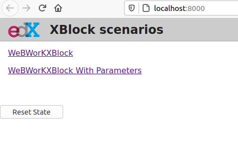
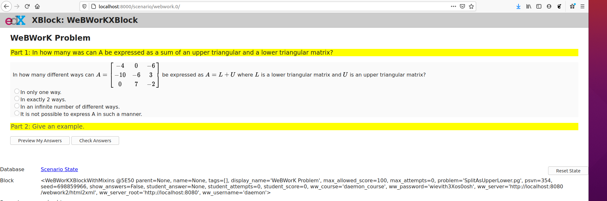
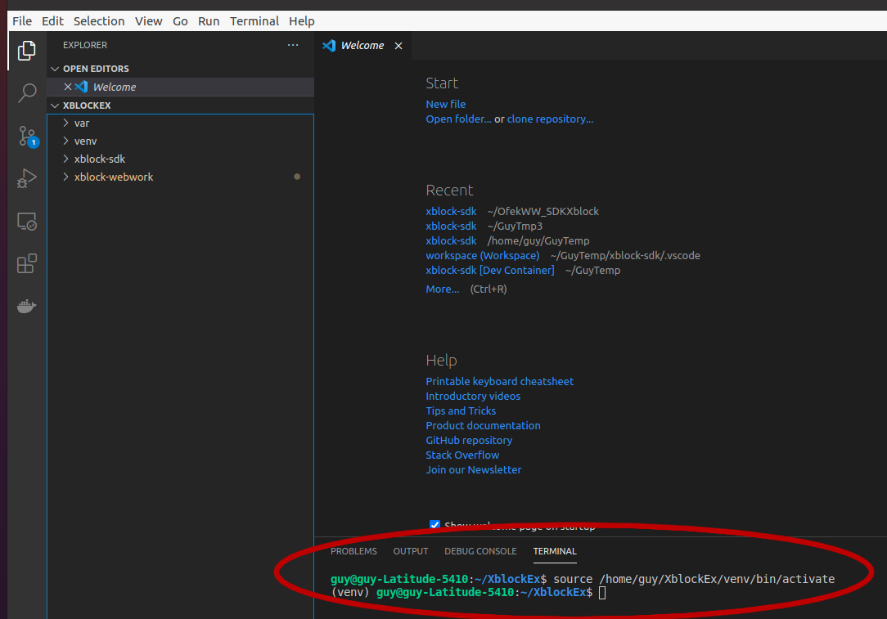
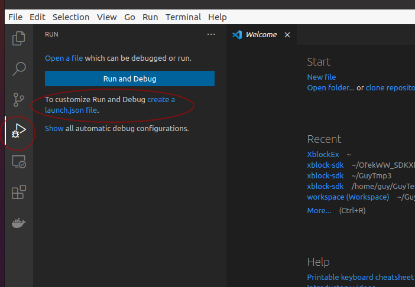
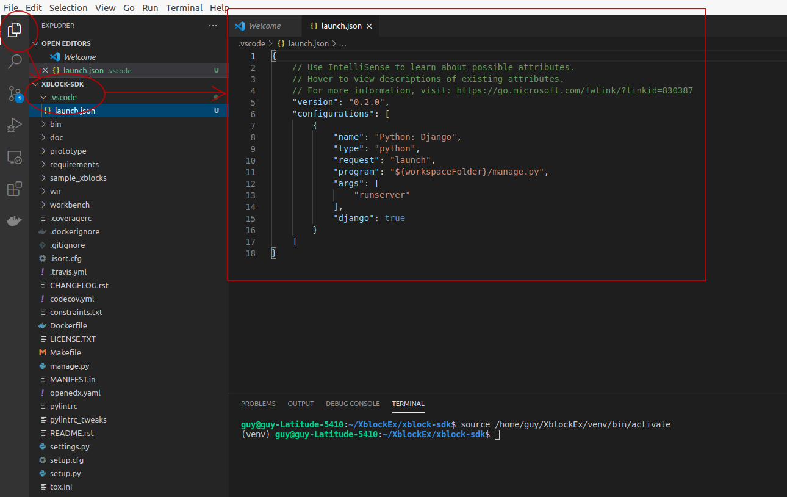
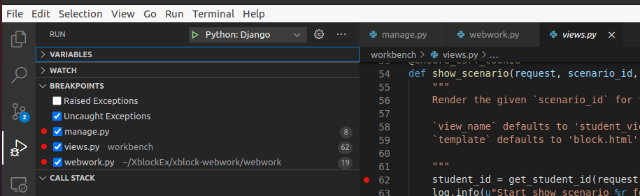
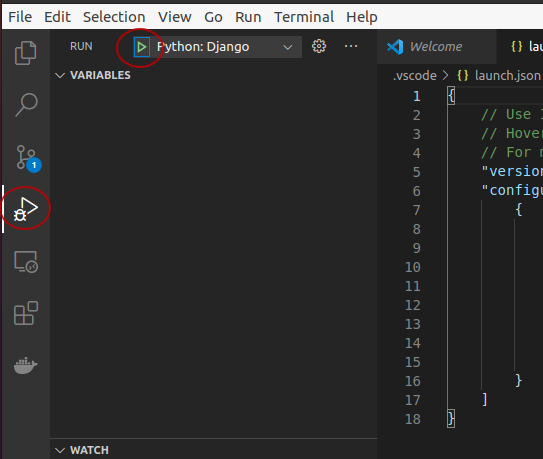

# 1. Preliminaries
This Tutorial should help the reader to install xblock-webwork into Open edX's full devstack environment and debug it with VS-Code.

edx-devstack environment pros-and-cons when compared with Open xblock-sdk environment:

**Pros:**
- Follow the full/accurate view of Open edX's course site
- Inherently supports course deadlines, grades, and  
  other management operations
- Therefore it is equiped with full development capabilities
- Accurately flags security and network complexities

**Cons:**
+ Heavy disc/cash/cpu usage
+ Though to install 
+ Though to debug
+ Thus remarkably slows down developing

It assumes that the reader have basic experience working with  
- linux shell commands
- python
- VS-Code
- Open edX's xblocks
- Open edX's devstack services (lms/studio etc')
- Docker containers.

Following this tutorial up to a successful end, will arm you with the capabilities of running webwork-xblock in edx-devstack environment and debug it through VS-Code (set breakpoints, watch variable values etc') 

Happy ending requires careful follow of the listed steps.

**Good luck!**

# 2. Prerequisites
1. Ubuntu + Python + virtualenv
2. Vscode with python + django + docker extension packs
3. Access to technion webwork2 server (contact Nathan Wallach (tani@mathnet.technion.ac.il) to acquire Authenticated user+password

# 3. installing Open edX Devstack
These instructions are based on the Edx instructions here:   
[Open edX Devstack](https://github.com/edx/devstack#open-edx-devstack--)

For practical reasons I set the xblock directory path **XblockEx**.  
Change it to your needs when following the instructions  

1. Create the directory:
    > mkdir XblockEx  
      cd XblockEx  
      mkdir edx-devstack  
      cd edx-devstack

2. Create and activate python virtual environment:
   >virtualenv venv  
    source venv/bin/activate

3. Clone and install Open-edX devstack:
   >git clone https://github.com/edx/devstack.git  
   cd devstack  
   make requirements  
   make dev.clone.https  
   make dev.pull  
   make dev.provision  
   make dev.down  
   >+ Note: provision takes several minutes to accomplish  

4. Activate all Open-edX service (containers) fleet and **wait at least 1-minute** after the command claims it is "done"
   > make dev.up
5. Verify all (17) containers are up (as opposed to Exited or othe state) with
   > docker ps -a
   >+ Note: consider using the watch command in a new command shell in order to watch the containers state indefinitly:  
   >watch -n1 "docker ps -a"  
6. Wait 1-minute Check it out to work properly in your browser:
   > http://localhost:18000
   >  
7. To be continued after the weekend....
<!--
7. Clone Ofek's webwork xblock:
   >git clone https://github.com/tsabaryg/xblock-webwork.git  
   * You will need to supply a git user and password with access permission.  
   Contact guyts@technion.ac.il or tani@mathnet.technion.ac.il for permission request.

8. Install Ofek's webwork xblock:
   > pip install -e xblock-webwork

9.  Create the SQLite Database([3.3.3](https://edx.readthedocs.io/projects/xblock-tutorial/en/latest/getting_started/create_first_xblock.html#create-the-sqlite-database:)).  
Notice that the first 2 commands and the last one are not Originally listed but mandatory for proper installation
   >mkdir var  
   pip install mock  
   python xblock-sdk/manage.py migrate  
   pip install xblock_utils

8. Run the webwork-xblock Django server:  
   > python xblock-sdk/manage.py runserver  
   
9.  Check it out to work properly in your browser:  
    >http://localhost:8000
    
    >  
10. Clicking one of the problems (here I took the first one), may typically look like this:  
    >

# 4.  Debug the webwork-xblock (Django server) with VS-Code
1. Open your VS-Code
2. Open the XblockEx Folder:
   >File -> Open Folder -> open XblockEx -> xblock-sdk
3. Choose the correct venv python interpreter:
   >View -> Command Palette -> Python: Select Interpreter -> Enter interpreter path -> Find..->  
   scroll to ~/XblockEx-> venv -> bin and choose python3.8
4. Open new terminal with activated venv:
   >Terminal->New terminal choose new terminal and it will open this terminal with the virtual environment activated:
     
5. Create a basic launch.json file adapted to running Django
   server of the type Python -> Django
   
6. This will end with .vscode directory with the basic Python/Django launch.json file inside:  
   >
7. Place breakpoints in some interesting points (./manage.py, ./workbench/views.py, XblockEx/xblock-webwork/webwork/webwork.py):
   > 
8. In Run sidebar choose the correct debug configuration (Python: Django) and press the green rectangle (F5 will equally work):  
   > 
9. Open the browser at http://127.0.0.1:8000/  
   and notice the interaction of the browser actions with your breakpoints
10. You are ready to develop/debug process of this project. Enjoy.

-->