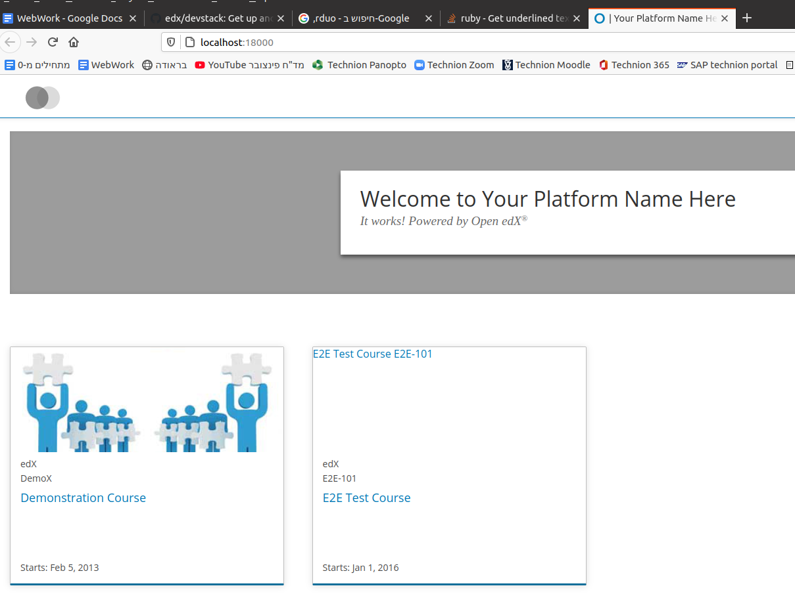
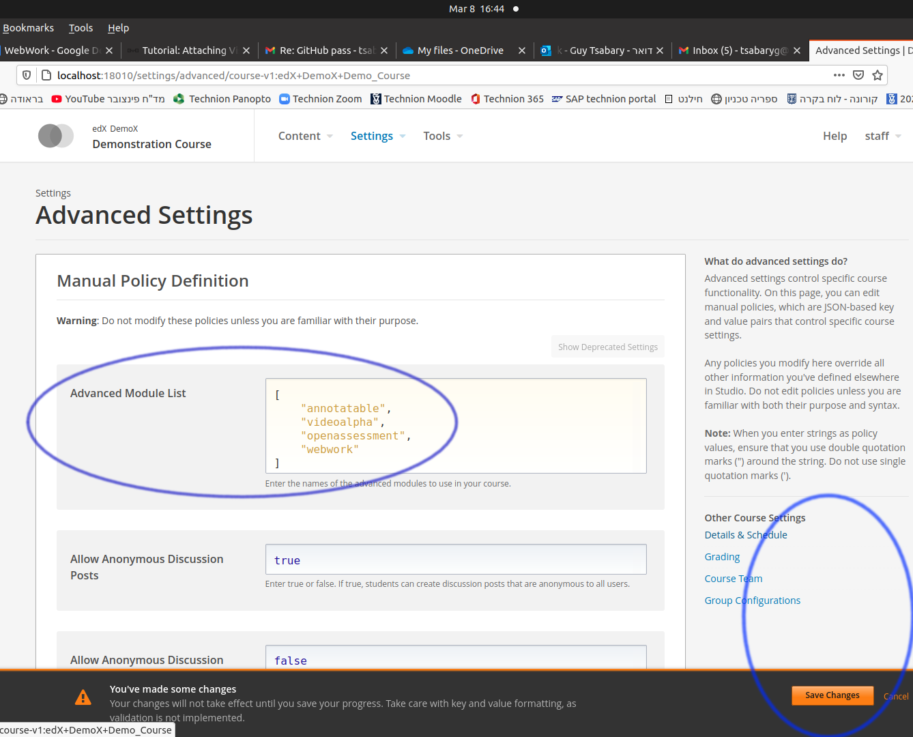
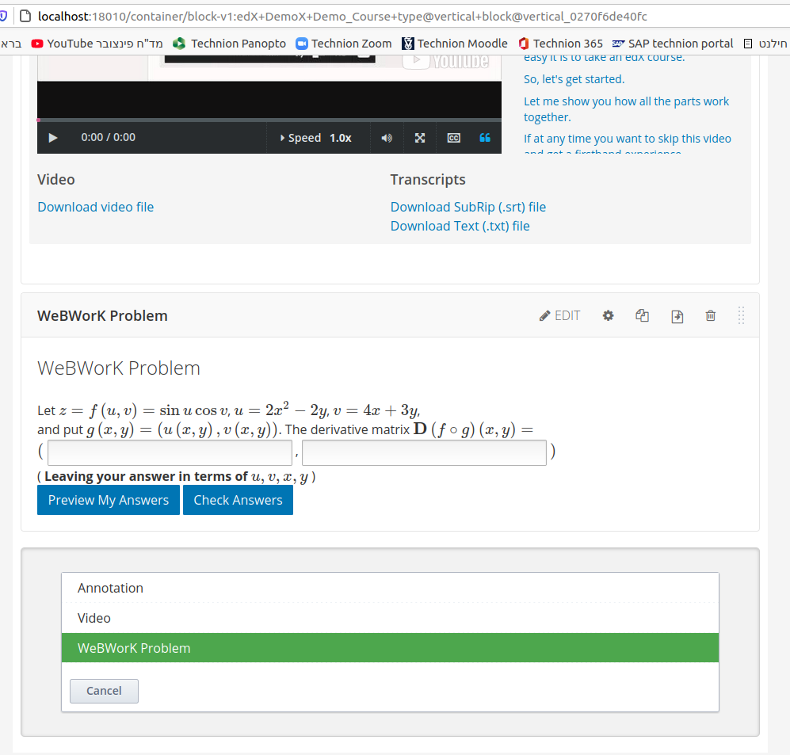

## Background
Testing the WeBWorK XBlock requires:
  1. A functioning installation of edX with the XBlock installed.
  2. A suitable "remote" WeBWorK server which can render WeBWorK problems
for the XBlock.

The goal of this guide is to set up an functional test system using the Docker
based edX devstack with the WeBWorK XBlock installed it in, and a local install
of the WeBWorK standalone renderer.

In order to make this test system reasonably stable, the devstack is being set
using to use a named release of edX and not the `master` branch of the 
devstack, which frequently changes. This file gives instructions for the 
Koa named release. The file at
https://github.com/Technion-WeBWorK/xblock-webwork/blob/master/install-docs/setup-devstack-named-release-with-webwork-xblock.md
has instructions for the Lilac named release.

This file is based on earlier instructions in
https://github.com/Technion-WeBWorK/xblock-webwork/blob/master/install-docs/setup-devstack-docker-with-webwork-xblock.md
which were not fully complete, and which did install a named release of edX
in the devstack.

## Hardware / software requirements

The installation of the edX devstack depends on using Docker.

The devstack requirements at https://github.com/edx/devstack#prerequisites
lists Python 3.8 as a prerequisite, and Ubuntu 20.04 LTS provides this
version of Python by default and is well supported by Docker.
As a result, this guide assumes that installation will be done in Ubuntu 20.04
LTS. 

Note: The majority of this process was also tested on Debian 11 ("bullseye") on
a machine which already had Docker installed.

Docker for Ubuntu, requires a 64-bit version of Ubuntu. (See https://docs.docker.com/engine/install/ubuntu/#prerequisites).

The requirements also state that Docker for Windows is **not** supported.

Use of different Linux distributions or Mac should be possible, but suitable
changes in the procedure will be needed.

### Hardware resources:

The devstack requirements at https://github.com/edx/devstack#prerequisites
provided the following guidance about system resources for using the devstack:

> We find that configuring Docker for Mac with a minimum of 2 CPUs, 8GB of memory, and a disk image size of 96GB does work.

We have been able to install the necessary portion of the devstack to test
the XBlock and the additional components on a test system which had 16GB RAM
using a Ubuntu partition of 50GB, and only about 30GB of disk space was used.
However, that installation did not install the full devstack, only Studio
and LMS and their dependencies. A full devstack would certainly use more space.

## Assumptions in the process below.

We assume that you are working in Ubuntu 20.04 and have an active
internet connection to allow package installation and other downloads.

We assume that the system was configured suitable to be able to install
packages from the Ubuntu repositories, and that your account can use
`sudo`.

## Install some additional Ubuntu packages and Python virtualenv

We first install some necessary packages and the Python virtualenv.
You may prefer to add some additional editor, if you are not comfortable with
`vim`.

```
sudo -s
apt-get update
apt-get -y install git python3-pip vim
pip3 install virtualenv
exit # Leave sudo
```

Check that Python 3.8 or later is installed:
```
python3 --version
```

## Install Docker and docker-compose

The steps below work as of when this guide was written, and are copied on
the Docker documentation site. If necessary, refer to the official
documentation:
  - https://docs.docker.com/engine/install/ubuntu/
  - https://docs.docker.com/engine/install/linux-postinstall/
  - https://docs.docker.com/compose/install/
for explanations, details, updates, etc.

The commands to run:
```
sudo -s
apt-get update
apt-get -y install apt-transport-https ca-certificates curl gnupg lsb-release

curl -fsSL https://download.docker.com/linux/ubuntu/gpg | sudo gpg --dearmor -o /usr/share/keyrings/docker-archive-keyring.gpg

echo "deb [arch=amd64 signed-by=/usr/share/keyrings/docker-archive-keyring.gpg] https://download.docker.com/linux/ubuntu $(lsb_release -cs) stable" | sudo tee /etc/apt/sources.list.d/docker.list > /dev/null

sudo apt-get update
sudo apt-get install docker-ce docker-ce-cli containerd.io

groupadd docker

curl -L "https://github.com/docker/compose/releases/download/1.29.2/docker-compose-$(uname -s)-$(uname -m)" -o /usr/local/bin/docker-compose
chmod +x /usr/local/bin/docker-compose

exit # Leave sudo

# Add your regular user to the docker group
sudo usermod -aG docker $USER
```

### Using Docker without sudo.

The `docker` group was created to allow you to run Docker commands
as your regular user. (This has security implications. See the Docker
documentation.)

That change is not fully active in your current login session.

It is often easiest to log out and the log back in, so that the system will
be aware that your user belongs to the `docker` group.

Alternatively, you can run `newgrp docker` which should set the group in
the current terminal.

### Test that Docker works

Test that docker is working (for the current user):
```
# If necessary run:
#           newgrp docker
docker run hello-world
# You should see the output from the test hello-world container.
```

## Install the edX devstack for the koa named release.

We have tested these instructions for the "koa" release.

### Primary sources:

- The instructions below install under `~/XblockEx` which can be changed.
- The official install instructions for devstack are at:
  - https://github.com/edx/devstack
- Documentation on installing a named release of edX in the devstack are at
  - https://github.com/edx/devstack/blob/master/docs/developing_on_named_release_branches.rst
  - **Warning:** The older instructions about this at https://edx.readthedocs.io/projects/edx-installing-configuring-and-running/en/open-release-hawthorn.master/installation/install_devstack.html are apparently somewhat outdated, and the order of several steps there seem to be **incorrect**.
- However, in order to save on resources, this guide does not install a full
devstack, and only installs the portions needed for using and testing the
WeBWorK XBlock.

### Setting OPENEDX_RELEASE for the future:

Using devstack with a named release requires that the `OPENEDX_RELEASE`
environment variable be set before various commands are run. This is necessary
both for the installation process, and in later use.

Thus, please add the `export OPENEDX_RELEASE=koa.master` line (included
in the steps below) into your `.bashrc` file (or whatever file/command is
needed if you are using a different shell) **after** completing the
installation. That will make the correct setting of this environment variable
automatically each time you open a new terminal, etc. (If the value is set before
the install process, one step below failed, so the value is unset before that step.)

**Note:** If you are working with multiple devstacks, you will need to set
the `OPENEDX_RELEASE` variable suitably when changing between devstacks.

### Doing the devstack install

Run the following steps as your regular user.
  - Many of these steps take quite a bit of time to run.

We first create and then start up the Python virtualenv we will be using.
You will need to start it up also in the future (skipping the `mkdir`).
```
mkdir -p ~/XblockEx/edx-devstack
cd ~/XblockEx/edx-devstack

virtualenv venv
source venv/bin/activate
```

Now we install the devstack (using the "koa" named release of edX):

```
git clone https://github.com/edx/devstack.git
cd devstack

make requirements
```

The `make dev.clone.https` step seems to work only when OPENEDX_RELEASE is NOT set (or at least not when it is set to "koa.master"), so unset it first:

```
export OPENEDX_RELEASE=
make dev.clone.https
```

---

When `make dev.clone.https` was run when `OPENEDX_RELEASE` was set the output reported a fatal error:
```
Cloning into 'frontend-app-payment'...
fatal: Remote branch open-release/koa.master not found in upstream origin
make[1]: *** [Makefile:192: impl-dev.clone.https] Error 128
make[1]: Leaving directory '/home/edxdevel/XblockEx/edx-devstack/devstack'
Would you like to assist devstack development by sending anonymous usage metrics to edX? Run `make metrics-opt-in` to learn more!
make: *** [Makefile:195: dev.clone.https] Error 2
```

---

Hence, we set the value of `OPENEDX_RELEASE` below (after the prior step).

```
# Change NOW to use the "koa" named release:
git checkout open-release/koa.master
export OPENEDX_RELEASE=koa.master

# The next command needs to be run after setting OPENEDX_RELEASE
make dev.checkout
```

The next step takes some time. Sometimes errors occur during the next step,
and that indicated that some of the devstack Docker image failed to
be downloaded / installed. This seems to be caused by network issues, and
gets resolved by running the command again. Thus, if you got any error,
please run the command again (possibly several times) until all images are
properly downloaded.

```
# This is where we install only the needed part of devstack
# instead of using "make dev.pull.large-and-slow" as in the main
# install instructions

make dev.pull.lms+studio
```

Reminder: If you get any errors from the last step, run it again until all
the Docker images are properly downloaded.

---

**The next step is known to take quite a bit of time.** After starting it, you
probably want to go do something else for a while (probably at least half an
hour).

**Alternatively**, you might want to try to run the "Standalone render"
installation from 2 sections down in parallel to the next command.

```
make dev.provision.lms+studio
```

When that last step ends, you should see a report that
> Provisioning complete!

## Do some local configuration for the XBlock installation in your devstack

The WeBWorK XBlock depends on using the "Other course settings" optional
feature to provide course-wide settings. As a result, this feature needs to
be enabled (for Studio and LMS) in the devstack.

See:
  - https://edx.readthedocs.io/projects/edx-installing-configuring-and-running/en/latest/configuration/enable_custom_course_settings.html
  - https://www.edunext.co/articles/discover-open-edx-ironwood/
  - https://openedx.atlassian.net/browse/OSPR-2303

For the devstack, the setting seems to need to be set in 2 files, as explained
below.

You should run the following steps while the devstack is still running
(so you can copy the files out of the running containers to make
persistent local copies to edit). Do so inside the Python virtualenv which
should still be running from the prior stage (or start up the venv again).

```
cd ~/XblockEx/edx-devstack/devstack
mkdir etc
docker cp edx.devstack-koa.master.studio:/edx/etc/studio.yml etc/studio.yml
docker cp edx.devstack-koa.master.studio:/edx/etc/lms.yml etc/lms.yml

cp etc/studio.yml etc/studio.yml.ORIG
cp etc/lms.yml etc/lms.yml.ORIG
```

Open the 2 files with your editor of choice, and add a new line
`ENABLE_OTHER_COURSE_SETTINGS: true` inside the `FEATURES` section of both
files.

```
vim etc/studio.yml etc/lms.yml
# Add the needed line to both files
```

Now, we modify the relevant `docker-compose-*.yml` files to use our
modified copies. First make backup copies of the files we are about to
edit, and then edit them with your editor of choice (`vim` below).

```
cp -a docker-compose-host.yml docker-compose-host.yml.ORIG
cp -a docker-compose-host-nfs.yml docker-compose-host-nfs.yml.ORIG

vim docker-compose-host.yml docker-compose-host-nfs.yml
```

Find the lines which mount "volumes" into the lms. The relevant lines
follow the lines
```
  lms:
    volumes:
```
and add the following 2 new lines below what is already listed:
```
      - "./etc/lms.yml:/edx/etc/lms.yml"
      - "./etc/studio.yml:/edx/etc/studio.yml"
```

Now find the lines for the studio "volumes" and add those same 2 lines at the
end of the list.

These changes are made in both files.

Now restart the Studio and LMS containers (commands to be run in the `venv`):

```
make dev.down.lms+studio
make dev.up.lms+studio
```

Note: It takes some time (typically close to a minute on my machine) for the
containers to get fully started after the command itself "finishes". That time
is needed for the container to fully start up everything it needs.

You can check the status of the container startup process by checking what is
report in the logs using the commands
```
docker logs edx.devstack-koa.master.studio
docker logs edx.devstack-koa.master.lms
```

Hopefully you will now be able to open http://localhost:18000 in your web
browser and see something like:
    

## Install the WeBWorK XBlock and configure devstack to load it

Now we  will install the XBlock code, and modify the devstack setup to
load it.

First install the code from the repository. (These lines need not be run
in the Python venv)

```
cd ~/XblockEx/edx-devstack/edx-platform/
mkdir src
cd src
git clone https://github.com/Technion-WeBWorK/xblock-webwork.git
```

Next we are going to edit the devstack `docker-compose.yml` file so
the devstack will reinstall and load the XBlock each time the devstack is
brought up. This is necessary if the code is being modified. (You can use a
different editor instead of `vim` but be careful not to break the required
formatting of the files being edited.)


```
cd ~/XblockEx/edx-devstack/devstack
cp -a docker-compose.yml docker-compose.yml.ORIG
vim docker-compose.yml
```

1. Find the "command" line in the "lms:" section of the file.
2. Make the copy of the original line into a commented out line
by adding a `#` at the start of the line.
3. In the active "command" line add the string `pip install /edx/app/edxapp/edx-platform/src/xblock-webwork/ &&` just before the `while true`.
   - The `pip install` we added should be between an old `&&` and the new one added here.
4. Repeat this process in the "studio:" section of the file.

**Note:** If you want to use the IDE debugging features discussed in
https://github.com/Technion-WeBWorK/xblock-webwork/blob/master/install-docs/devstack-install-and-debug.md
you would also want to add `pip install ptvsd` in a similar manner.
As this guide is not addressing IDE debugging, that additional install is not
required in the "command" lines we edited above.

Restart the devstack, by running the following lines in the "venv":
```
make dev.down.lms+studio
make dev.up.lms+studio
```

## Install and configure a local installation of the WeBWorK standalone renderer

This step is somewhat independent of the prior 2 steps, and could be done
in parallel to them, so long as the additional network load will not
interfere with the other installation steps.

### Installation:

The installation directory `~/Render` is used below, but can be changed.

The process is essentially that from the `README.md` at
https://github.com/drdrew42/renderer
but we add local configuration files and enable using `docker-compose` to
start and stop the renderer.

Run the following commands in a new terminal window.
  - If you did not log out after adding your user to the `docker` group, you
    will probably need to run `newgrp docker` before using docker commands
    below.

```
mkdir ~/Render
cd ~/Render

mkdir volumes
mkdir container
git clone https://github.com/openwebwork/webwork-open-problem-library volumes/webwork-open-problem-library
git clone --recursive https://github.com/drdrew42/renderer container/

# If needed use
#     newgrp docker

docker build --tag renderer:1.0 ./container

### Customized configuration:

# Create render_app.conf
cp container/render_app.conf.dist render_app.conf
```

Next we edit `render_app.conf`:
```
vim render_app.conf
```
and replace the value of `problemJWTsecret` with a sample value which will
work.
  - The python side JWT code in use by the XBlock requires that the value
    be a 32-octet "string". Since it is ready in both on the edX side and on
    the Standalone renderer side from a string, we recommend using only 7-bit
    ASCII characters, to avoid any problems with character-set related
    conversions leading to the value not being properly received.
  - For the sample testing, please use
    `problemJWTsecret => 'AAAAAAAAAAAAAAAAAAAAAAAAAAAAAAAA'` or make sure to
     set the same value in this file and in the configuration later added to
     the "Other course settings" in edX Studio.

**Warning:** for local use of the Standalone renderer with edX devstack
on a single computer, you should **not** replace the value of `SITE_HOST`
in the `render_app.conf` file. It should remain `http://localhost:3000` as
your browser will be loading auxiliary files needed by WeBWorK problems from
there. However, in production use, that value should be changed, and then
the `aud` setting provided to the edX system via "Other course settings"
should also be modified in the same manner.

Now create a `docker-compose.yml` file for the Standalone renderer.
Create a file containing the following text:
```
version: '3.5'
networks:
  default:
    external:
      name: devstack-koamaster_default

services:
  renderer:
    image: renderer:1.0

    volumes:
      # Local config file
      - "./render_app.conf:/usr/app/render_app.conf"
      # OPL
      - "./volumes/webwork-open-problem-library:/usr/app/webwork-open-problem-library"
    # END volumes

    hostname: wwstandalone

    ports:
      - "3000:3000"

    environment:
      MOJO_MODE: development

```

The "special" settings made here are:
  1. Attaching the Standalone render to the Docker `devstack-koamaster_default` network, which is the Docker network devstack will use the "koa" named release.
  2. Naming the container as "wwstandalone" which will be used also in the "Other course settings" configuration on the edX side.
  3. Using the local `render_app.conf` we just created.
  4. Setting the `MOJO_MODE` to `development` so localhost:3000 gives the Standalone developer's web interface (which is not available in production mode).

### How to start/stop the renderer

Now we can start up the Standalone renderer as follows:
```
cd ~/Render ; docker-compose up -d
```
and stop it (when needed) using
```
cd ~/Render ; docker-compose down
```

The configuration assumes that the necessary Docker network exists,
and it created when the devstack is brought up. Thus, it is simplest to
start the renderer after starting up the devstack.

**Note:** At present, once the renderer is running, you should be able to open
http://localhost:3000 to see the "local editor" provided by the Standalone
renderer. Pull request https://github.com/drdrew42/renderer/pull/62
is intended to close that for "production" mode, so once that gets merged
some additional configuration will apparently be necessary to reenable that
feature on the Docker installed Standalone renderer.

## Configuring the demo course to use the XBlock, and testing a WeBWorK problem

We assume that all prior steps were successfully completed, and that the
devstack and Standalone renderer are both up a running.

### Configuration:

1. Open in your web browser the page http://localhost:18010/settings/advanced/course-v1:edX+DemoX+Demo_Course
2. Log in (using devstack defaults) as: `staff@example.com` with the password `edx`
3. You should be able to scroll down and find the "Other Course Settings" section.
   - If you are in the settings and it is not there, something went wrong with the changes to enable this feature, either in the `etc/studio.yml` file or in how it was mounted into the Docker container.
   - If you did not yet stop and restart the containers, that could be the cause of this special section of settings being missing.
4. If you find the "Other Course Settings" section, replace the content with that listed below.
   - On a production server, if there are already settings, you would need to add the content of the enclosing JSON object into the existing settings, as a new top level key/value pair.
5. Scroll to find the "Advanced Module List" on this page.
6. Add "webwork" to the list (by adding `"webwork"` and adding the comma where it is needed).
   
7. Save the settings.

#### Sample settings for "Other Course Settings"
```
{
    "webwork_settings": {
        "server_settings": {
            "LocalStandAloneWW": {
                "server_type": "standalone",
                "server_api_url": "http://wwstandalone:3000/render-api",
                "auth_data": {
                    "aud": "http://localhost:3000",
                    "problemJWTsecret": "AAAAAAAAAAAAAAAAAAAAAAAAAAAAAAAA"
                }
            }
        },
        "course_defaults": {
            "default_server": "LocalStandAloneWW",
            "psvn_shift": 51
        }
    }
}

```

### Adding a test WeBWorK problem:

1. Click on "Content" and select "Outline" in your browser tab.
2. Add a new subsection to week 1 called "WeBWorK problems".
3. Add a new unit to that subsection.
4. The browser should automatically open the page for the new unit.
5. Scroll down and Click on "Advanced" in "Add New Component" (at the bottom of the page) and then on "WeBWorK problem".
   

The problem you add will report:
```
  WeBWorK Problem
  An unexpected error occurred!
```
and inside the iFrame:
```
  Your problem should load soon.
  Please wait.
```

This occurs when a new instance of the XBlock is added, because some settings
are properly set only after the problem settings are edited. In typical use,
the default value for the problem to give are not what would be needed, so this
"bug" does not seem critical.

Now click "Edit" on the "bar" above the problem, and then just "Save" the
settings.

The problem should now render. If not, first make sure that the Standalone
renderer Docker container is running, if so have a look at the Docker logs for
the container. Also check that the settings are correct on both sides, and in
particular that the same value for `problemJWTsecret` is in use by both
systems.

Now try to add a second problem, and change the value of "Problem" to the
path to a different OPL problem (or something else available to the
renderer you are using). For example, you can try
`Library/UBC/setDerivatives/differentiability1.pg` which was picked quite
arbitrarily.

Try interacting with these problems.

You can edit them to set limits on the number of attempts allowed, etc.

"Publish" the unit.

Now click "View live version" and the unit should open in the LMS (port 18000).

### Some things you can try out

If you add WeBWorK problems to a section with a deadline, the behavior of the
problem should change before the deadline (and course grade period) pass, and
then get locked for the number of hours set in the post_deadline_lockdown
setting of the problem, and then reopen for additional use which is not for
credit.

In the post-lockdown period, correct answers should be available
unless the "allow_show_answers" of the problem was changed to false.
When there is no deadline, correct answers should become available
after the permitted number if graded attempts is exhausted (or if unlimited,
after the number of attempts set in the problem setting
`no_attempt_limit_required_attempts_before_show_answers` which defaults to 10
attempts).

## Startup and Shutdown procedures

### Startup

1. Start venv if needed, if running change to the correct window with the `venv`
```
cd ~/XblockEx/edx-devstack
virtualenv venv
source venv/bin/activate
```
2. In the `venv`:
```
cd ~/XblockEx/edx-devstack/devstack ; make dev.up.lms+studio
```
3. In a DIFFERENT terminal (not in the `venv`) start the Standalone renderer
```
cd ~/Render ; docker-compose up -d
```
4. Wait until the edX devstack is fully up before accessing edX pages in browser
  - You can run `docker logs edx.devstack-koa.master.studio` and/or
    `docker logs edx.devstack-koa.master.lms` to check the progress.

### Shutdown

1. Stop the Standalone renderer. This command does not need to be in the `venv`:
```
cd ~/Render ; docker-compose down
```
2. Start venv if needed, if running change to the correct window with the `venv`
```
cd ~/XblockEx/edx-devstack
virtualenv venv
source venv/bin/activate
```
3. In the `venv`:
```
cd ~/XblockEx/edx-devstack/devstack ; make dev.down
```


