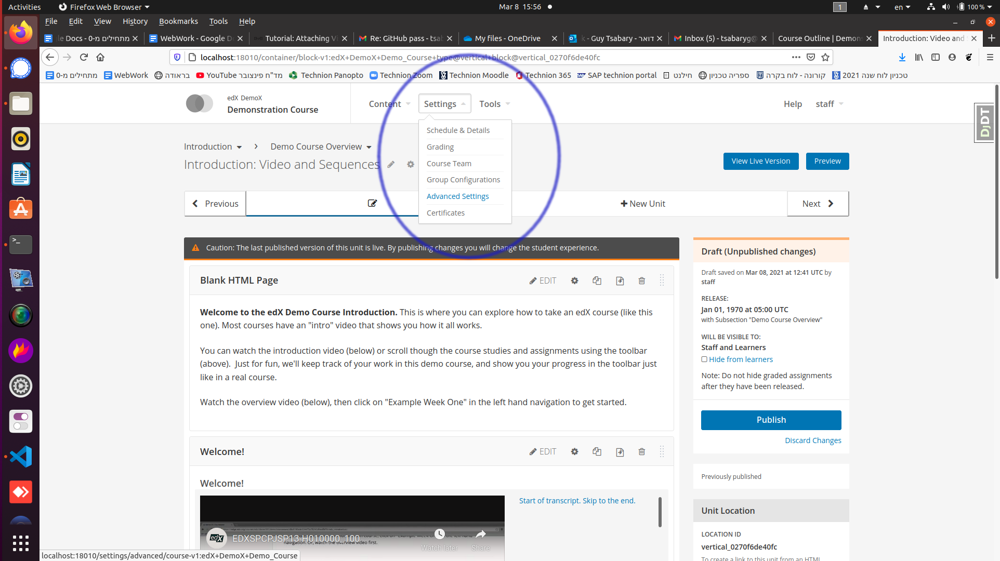

<!--
Colors convention: a Bootstrap-like color convention is followed see e.g.
https://www.w3schools.com/bootstrap4/bootstrap_colors.asp

Uncomment these HTML lines to see the effect and
copy-paste in document up to need

Primary text  
Success text  
Info text here  
Warning text  
Danger text  
Faded text  
-->

**Warning:** Recent changes to the master branches of devstack and the edX codebase seem to interfere
with using the "master" branches, which did work until relatively recently. For now, we recommend installing
using a "named" release as explained in:
https://github.com/Technion-WeBWorK/xblock-webwork/blob/master/install-docs/setup-devstack-named-release-with-webwork-xblock.md
and then following the instructions below to set up the debugging tools.

---

The goal of this guide is to help you set up an environment with the edX Docker
based devstack with the webwork XBlock installed it in.

## 1. Hardware requirements
An up-to-date developer computer of the last 3 years, with 16GB ram should suffice.

## 2. Download latest Ubuntu-LTS iso file
Here it was ubuntu-20.04.2.0-desktop-amd64.iso

## 3. Create a bootable disk-on-key with Ubuntu
Use windows desktop to [Download Rufus](https://rufus.ie/en_US/#google_vignette) and double-click rufus-***.exe to Create a bootable ubuntu usb drive loaded with the Ubuntu-LTS iso file.

## 4. Install Ubuntu
1. Insert the disk-on-key into the intended comp
2. Power up the computer and follow the normal Ubuntu installation instructions.  
3. When done reboot into the freshly installed Ubuntu OS

## 5. Install python + git + pip + virtualenv
Warning: Verify there is an active Internet connection which is mandatory for package installs 

Open a terminal / command-shell and install python + git + pip + virtualenv:
> sudo apt-get update  
> echo "Checking your Python 3 interpreter..it is:" && python3 --version  
> sudo apt install git  
> sudo apt install python3-pip  
> sudo pip3 install virtualenv

## 6. Install docker
Here it is assumed that the computer architecture is either  x86_64 or amd64, otherwise, properly choose the long command **echo \\..** in the [instructions](https://docs.docker.com/engine/install/ubuntu/)
> sudo apt-get update  
> sudo apt-get install apt-transport-https ca-certificates curl 
    gnupg lsb-release  

>curl -fsSL https://download.docker.com/linux/ubuntu/gpg | sudo gpg --dearmor -o /usr/share/keyrings/docker-archive-keyring.gpg  

> echo \
"deb [arch=amd64 signed-by=/usr/share/keyrings/docker-archive-keyring.gpg] https://download.docker.com/linux/ubuntu \
$(lsb_release -cs) stable" | sudo tee /etc/apt/sources.list.d/docker.list > /dev/null  

> sudo apt-get update  
> sudo apt-get install docker-ce docker-ce-cli containerd.io

## 7. Create a docker group
This stage will [Enable docker commands without sudo prefix](https://stackoverflow.com/questions/48957195/how-to-fix-docker-got-permission-denied-issue)
> sudo groupadd docker  
> sudo usermod -aG docker $USER  
> newgrp docker  
> docker run hello-world  
> (docker stop $(docker ps -a -q) && docker rm $(docker ps -a -q))

## 8. Create an edx directory
Here I arbitrarily chosen **XblockEx** directory name
> mkdir XblockEx  
> cd XblockEx  
> mkdir edx-devstack  
> cd edx-devstack

## 9. Create and activate python virtual environment
> virtualenv venv  
> source venv/bin/activate

## 10. Clone and install Open-edX devstack
> git clone https://github.com/edx/devstack.git  
> cd devstack  
> make requirements  
> make dev.clone.https  

> echo "This stage requires good internet connection and will take few minutes:" && make dev.pull.large-and-slow  

> echo "This is a very network/cpu intensive stage and will take 30-60 minutes unless a very strong pc is used:" && make dev.provision  

> make dev.down
## 11. Verify correct installation
1. Activate all Open-edX containers and **wait at least 1-minute** after the command claims it is "done" with:
   > make dev.up
2. Verify all containers are up (as opposed to Exited or other state) with
   > docker ps -a
3. Wait about 1-minute and check it out to work properly in your browser:  
    http://localhost:18000  
      
4.
    > make dev.down
  
## 12. Clone xblock-webwork into edx-platform/src/
> cd ../edx-platform/  
> mkdir src  
> cd src  
> git clone https://github.com/Technion-WeBWorK/xblock-webwork.git

## 13. Add xblock-webwork to docker-compose.yml in a manner which will reinstall the code on each startup (necessary when development is being done):  
> cd ~/XblockEx/edx-devstack/devstack  
+ Open docker-compose.yml with VS-Code or nano
+ Navigate in the file Under the line of  
    lms: 
    > replace (or comment) the long bash command into:  
    > 
        lms:  
        command: >
            bash -c '
            source /edx/app/edxapp/edxapp_env && 
            pip install ptvsd && 
            pip install /edx/app/edxapp/edx-platform/src/xblock-webwork/ && 
            while true; do python /edx/app/edxapp/edx-platform/manage.py 
            lms runserver 0.0.0.0:18000 --settings devstack_docker;
            sleep 2; done'

+ repeat equivalent change with studio - navigate Under the line of studio: 
    > replace (or comment) the long bash command into:  
    > 
        studio:
        command: >
            bash -c '
            source /edx/app/edxapp/edxapp_env && 
            pip install ptvsd && 
            pip install /edx/app/edxapp/edx-platform/src/xblock-webwork/ && 
            while true; do python /edx/app/edxapp/edx-platform/manage.py cms 
            runserver 0.0.0.0:18010 --settings devstack_docker; 
            sleep 2; done'

+ Save and exit

## Enable and use "Other course settings"

You need to set up the capability to use "Other course settings" and make the necessary settings
there, in order to get a fully functioning XBlock. That is needed to allow making the course-wide
settings, so server settings need not be set for each problem (which is not recommended).

See https://github.com/Technion-WeBWorK/xblock-webwork/blob/master/install-docs/setup-devstack-named-release-with-webwork-xblock.md
where that was done for an install of the "lilac" named release in a devstack.

**Note:** Problems using `settings_type` "Manual settings" and directly providing all the
corrrect server configuration will probably work without "Other course settings".
That approach is **not** recommended.

## 14. Enable the XBlock in Your Course:  
  + Typically it suffices to only start the LMS and Studio containers and their dependencies,
  + > make dev.up.lms+studio
  + **navigate to localhost:18000**  
  + Sign in into http://localhost:18000 with  
     > Login: staff@example.com  
     > Pass: edx  
  + Navigate in the browser to: Demonstration Course->view in studio->view live->view in studio
  + From the course Settings menu, select Advanced Settings:  
     
  + In the Advanced Module List field, place your cursor between the braces, add a comma and then type "webwork":  
      
  + Save the settings  
  + Navigate again to: Demonstration Course->view in studio->view live->view in studio
  + Scroll down and find Add New Component -> Advanced
    And choose your Webwork Problem -> done:  
     

